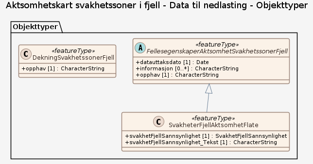

### Datamodell

#### SvakheterFjellAktsomhetFlate

områder hvor det er sannsynlig eller mindre sannsynlig at det forekommer svakhetssoner i fjellet

Egenskaper

<table class="feature-attribute-table">
  <colgroup>
    <col style="width: 35%;" />
    <col style="width: 65%;" />
  </colgroup>
  <tbody>
    <tr>
      <th scope="row">Navn:</th>
      <td><strong>svakhetFjellSannsynlighet</strong></td>
    </tr>
    <tr>
      <th scope="row">Definisjon:</th>
      <td>sannsynlighet for at det skal forekomme svakhetssoner i fjell</td>
    </tr>
    <tr>
      <th scope="row">Multiplisitet:</th>
      <td>1</td>
    </tr>
    <tr>
      <th scope="row">Type:</th>
      <td>SvakhetFjellSannsynlighet</td>
    </tr>
    <tr>
      <th scope="row">Tillatte verdier:</th>
      <td>- Kodeliste: <a href="http://skjema.geonorge.no/legg_inn_riktig_url">http://skjema.geonorge.no/legg_inn_riktig_url</a> - Ikke påvist svakhetssoner i fjell – Områder uten påviste svakhetssoner - Mindre sannsynlige svakhetssoner i fjell – Områder med lav sannsynlighet for svakhetssoner - Sannsynlige svakhetssoner i fjell – Områder med høyere sannsynlighet for
svakhetssoner - Usikre områder – Områder med usikker tolkning</td>
    </tr>
  </tbody>
</table>

<table class="feature-attribute-table">
  <colgroup>
    <col style="width: 35%;" />
    <col style="width: 65%;" />
  </colgroup>
  <tbody>
    <tr>
      <th scope="row">Navn:</th>
      <td><strong>svakhetFjellSannsynlighet_Tekst</strong></td>
    </tr>
    <tr>
      <th scope="row">Definisjon:</th>
      <td>sannsynlighet for at det skal forekomme svakhetssoner i fjell</td>
    </tr>
    <tr>
      <th scope="row">Multiplisitet:</th>
      <td>1</td>
    </tr>
    <tr>
      <th scope="row">Type:</th>
      <td>CharacterString</td>
    </tr>
  </tbody>
</table>

Relasjoner

**Arv**
FellesegenskaperAktsomhetSvakhetssonerFjell

#### FellesegenskaperAktsomhetSvakhetssonerFjell (abstrakt)

abstrakt objekttype som bærer en rekke egenskaper som er fagområde-uavhengige og kan benyttes for alle objekttyper  Merknad: Spesielt i produktspesifikasjonsarbeid vil en velge egenskaper og avgrensningslinjer fra denne klassen.

Egenskaper

<table class="feature-attribute-table">
  <colgroup>
    <col style="width: 35%;" />
    <col style="width: 65%;" />
  </colgroup>
  <tbody>
    <tr>
      <th scope="row">Navn:</th>
      <td><strong>datauttaksdato</strong></td>
    </tr>
    <tr>
      <th scope="row">Definisjon:</th>
      <td>dato for uttak fra en database  Merknad: Skiller seg fra Kopidato ved at en ikke skiller på om det er uttak fra en originaldatabase eller en kopidatabase.</td>
    </tr>
    <tr>
      <th scope="row">Multiplisitet:</th>
      <td>1</td>
    </tr>
    <tr>
      <th scope="row">Type:</th>
      <td>DateTime</td>
    </tr>
  </tbody>
</table>

<table class="feature-attribute-table">
  <colgroup>
    <col style="width: 35%;" />
    <col style="width: 65%;" />
  </colgroup>
  <tbody>
    <tr>
      <th scope="row">Navn:</th>
      <td><strong>informasjon</strong></td>
    </tr>
    <tr>
      <th scope="row">Definisjon:</th>
      <td>generell opplysning  Merknad: mulighet til å legge inn utfyllende informasjon om objektet</td>
    </tr>
    <tr>
      <th scope="row">Multiplisitet:</th>
      <td>0..*</td>
    </tr>
    <tr>
      <th scope="row">Type:</th>
      <td>CharacterString</td>
    </tr>
  </tbody>
</table>

<table class="feature-attribute-table">
  <colgroup>
    <col style="width: 35%;" />
    <col style="width: 65%;" />
  </colgroup>
  <tbody>
    <tr>
      <th scope="row">Navn:</th>
      <td><strong>opphav</strong></td>
    </tr>
    <tr>
      <th scope="row">Definisjon:</th>
      <td>referanse til opphavsmaterialet, kildematerialet, organisasjons/publiseringskilde  Merknad: Kan også beskrive navn på person og årsak til oppdatering</td>
    </tr>
    <tr>
      <th scope="row">Multiplisitet:</th>
      <td>1</td>
    </tr>
    <tr>
      <th scope="row">Type:</th>
      <td>CharacterString</td>
    </tr>
  </tbody>
</table>

#### DekningSvakhetssonerFjell

dekningsområde for datasettet Aktsomhetskart svakhetssoner i fjell

Egenskaper

<table class="feature-attribute-table">
  <colgroup>
    <col style="width: 35%;" />
    <col style="width: 65%;" />
  </colgroup>
  <tbody>
    <tr>
      <th scope="row">Navn:</th>
      <td><strong>opphav</strong></td>
    </tr>
    <tr>
      <th scope="row">Definisjon:</th>
      <td>referanse til opphavsmaterialet, kildematerialet, organisasjons/publiseringskilde  Merknad: Kan også beskrive navn på person og årsak til oppdatering</td>
    </tr>
    <tr>
      <th scope="row">Multiplisitet:</th>
      <td>1</td>
    </tr>
    <tr>
      <th scope="row">Type:</th>
      <td>CharacterString</td>
    </tr>
  </tbody>
</table>

### Kodelister

#### «Enumeration» SvakhetFjellSannsynlighet

**Definisjon:** klasser basert på sannsynlighet for at det skal forekomme svakhetssoner i fjell

Profilparametre i tagged values

<table class="feature-attribute-table">
  <colgroup>
    <col style="width: 35%;" />
    <col style="width: 65%;" />
  </colgroup>
  <tbody>
    <tr>
      <th scope="row">asDictionary</th>
      <td>false</td>
    </tr>
    <tr>
      <th scope="row">codeList</th>
      <td><a href="http://skjema.geonorge.no/legg_inn_riktig_url">http://skjema.geonorge.no/legg_inn_riktig_url</a></td>
    </tr>
  </tbody>
</table>

Koder

<table class="code-list-table">
  <thead>
    <tr>
      <th>Kodenavn:</th>
      <th>Definisjon:</th>
      <th>Kodeverdi:</th>
    </tr>
  </thead>
  <tbody>
    <tr>
      <td>Ikke påvist svakhetssoner i fjell</td>
      <td>Områder uten påviste svakhetssoner</td>
      <td></td>
    </tr>
    <tr>
      <td>Mindre sannsynlige svakhetssoner i fjell</td>
      <td>Områder med lav sannsynlighet for svakhetssoner</td>
      <td></td>
    </tr>
    <tr>
      <td>Sannsynlige svakhetssoner i fjell</td>
      <td>Områder med høyere sannsynlighet for
svakhetssoner</td>
      <td></td>
    </tr>
    <tr>
      <td>Usikre områder</td>
      <td>Områder med usikker tolkning</td>
      <td></td>
    </tr>
  </tbody>
</table>
