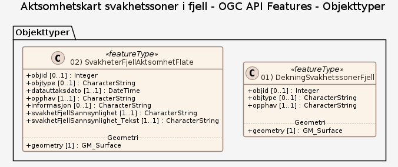

### Datamodell - Data til nedlasting

➡️ [Se full datamodell for omfang "Data til nedlasting" (diagram og objektkatalog)](data-til-nedlasting/objektkatalog.html)

### Datamodell - OGC API Features

➡️ [Se full datamodell for omfang "OGC API Features" (diagram og objektkatalog)](ogc-api-features/objektkatalog.html)
